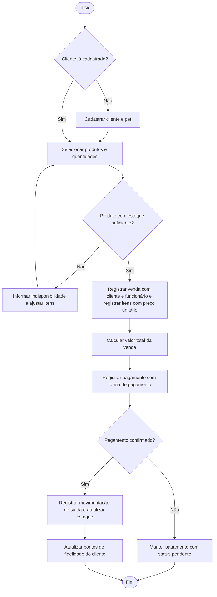
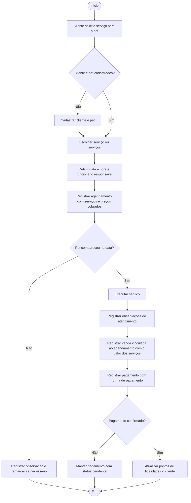
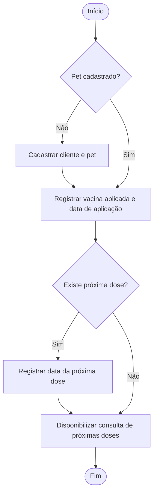
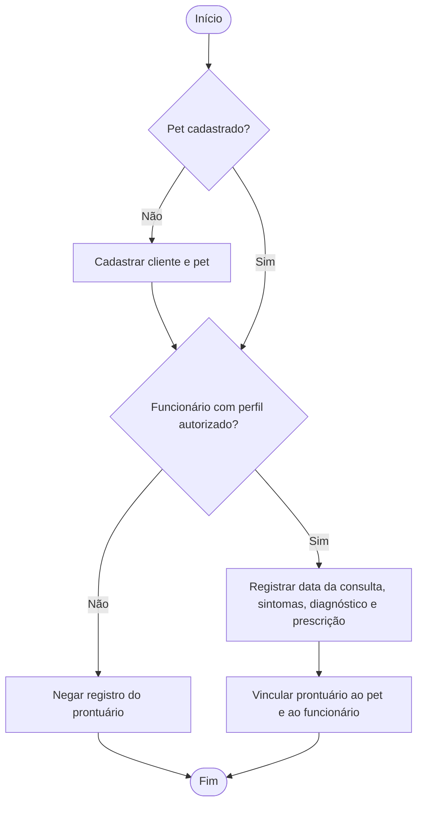
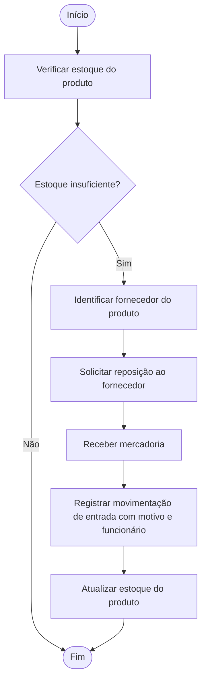
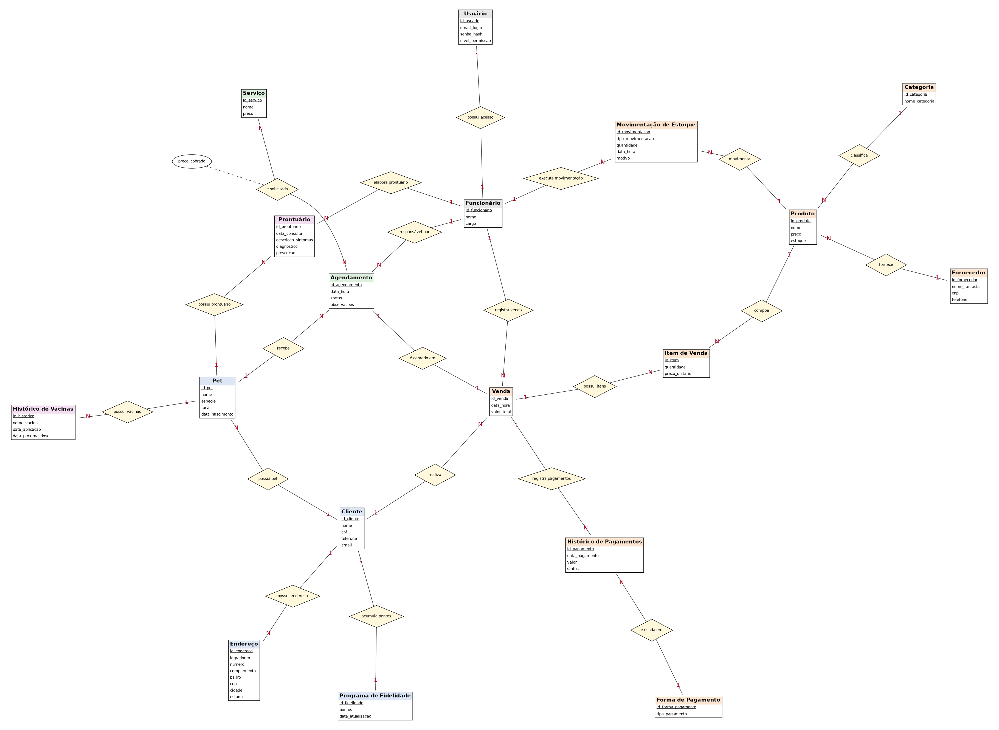

# Projeto ERP — Tati Peti Shop

> Primeira entrega — Projeto Integrador de Modelagem de Dados
> Do problema real ao Modelo Conceitual de Dados

---

## 1. Identificação da equipe

| Integrante | Matrícula |
|---|---|
| Adrian Guilherme Vieira Gomes | 47666188 |
| Bruno Novais de Sousa | 47921129 |
| João Victor Gomes Santana | 1747699736 |
| Kauan Camargo Anastácio | 47281405 |
| Leonardo Fonseca | 47354313 |
| Marcelo Eduardo de Souza Júnior | 47128828 |
| Matheus Masayuki Kikuta | 47354267 |
| Pedro Araújo | 47920742 |
| Ryan da Purificação de Oliveira | 47508442 |

---

## 2. Caracterização da empresa

**Nome:** Tati Peti Shop
**Segmento:** comércio varejista e prestação de serviços para animais de estimação (pet shop de pequeno porte).

**O que vende e oferece**
- **Produtos:** rações, acessórios, itens de higiene e demais artigos para pets, organizados por categorias e adquiridos de fornecedores.
- **Serviços:** serviços de cuidado e estética agendados com antecedência (como banho e tosa), executados por funcionários.
- **Acompanhamento de saúde:** registro do histórico de vacinas dos animais (data de aplicação e próxima dose) e registro clínico dos atendimentos veterinários (prontuário com sintomas, diagnóstico e prescrição).
- **Fidelização:** programa de pontos para clientes cadastrados.

**Principais clientes:** tutores (donos) de animais de estimação, que compram produtos, agendam serviços para seus pets e esperam ser reconhecidos como clientes recorrentes.

**Principais setores**

| Setor | Responsabilidade |
|---|---|
| Atendimento / balcão | Cadastro de clientes, endereços e pets; atendimento e agendamentos |
| Vendas / caixa | Registro de vendas, itens, pagamentos e formas de pagamento; cobrança de serviços |
| Estoque e compras | Controle de produtos, categorias, fornecedores, estoque e movimentações |
| Serviços | Execução dos serviços agendados por funcionários responsáveis |
| Saúde do pet | Registro de vacinas e de prontuários |
| Fidelização | Acúmulo e atualização de pontos dos clientes |
| Administração | Cadastro de funcionários e controle de acesso ao sistema |

**Como funciona atualmente (cenário considerado no projeto):** as informações da loja são registradas de forma dispersa, em planilhas, anotações e agenda em papel. O cadastro do cliente fica separado do cadastro do pet, o estoque é conferido manualmente, as vendas não atualizam o estoque, entradas e perdas de mercadoria não ficam registradas, o histórico de vacinas e os registros clínicos dependem de anotações soltas, os pagamentos são anotados separadamente das vendas e não há controle sobre quem realizou cada operação. Isso dificulta acompanhar vendas, estoque, agenda e relacionamento com o cliente.

**Informações importantes para o negócio:** dados de clientes, endereços e pets; catálogo de produtos, preços, categorias e estoque; fornecedores; vendas e itens vendidos; pagamentos e formas de pagamento; serviços e agenda; vacinas e prontuários; movimentações de estoque; pontos de fidelidade; funcionários e usuários do sistema.

---

## 3. Justificativa da escolha

O pet shop foi escolhido por reunir, em uma única empresa pequena, **vários processos que dependem uns dos outros**, o que o torna adequado para um projeto de modelagem de dados e para a aplicação de um sistema ERP:

- **Processos analisáveis e distintos:** venda de produtos, pagamento, controle de estoque, agendamento de serviços, acompanhamento de vacinas e prontuário, e fidelização.
- **Problemas reais de organização da informação:** dados duplicados entre planilhas, estoque desatualizado, agenda em papel e ausência de histórico consolidado do cliente e do pet.
- **Necessidade clara de integração:** uma venda impacta estoque, pagamento e pontos de fidelidade; um agendamento envolve cliente, pet, serviços, funcionário e cobrança no caixa.
- **Riqueza de relacionamentos:** o modelo apresenta relações 1:N, 1:1, N:N com atributo próprio e entidade associativa, permitindo exercitar todas as etapas do manual.
- **Evolução natural:** o modelo pode crescer para compras junto a fornecedores, controle financeiro e emissão de relatórios.

---

## 4. Problemas identificados

| Nº | Problema | Consequência |
|---|---|---|
| P01 | Cadastro de clientes e pets em planilhas/anotações separadas | Duplicidade e dificuldade de saber quais pets pertencem a cada cliente |
| P02 | Controle manual de estoque | Erros na quantidade disponível; venda de produto sem estoque |
| P03 | Vendas não integradas ao estoque | Informações de estoque desatualizadas |
| P04 | Preços registrados sem histórico | Impossível saber por quanto um produto ou serviço foi cobrado em cada operação |
| P05 | Pagamentos anotados separadamente das vendas | Dificuldade de saber o que foi pago, o que está pendente e como foi pago |
| P06 | Agenda de serviços em papel | Conflitos de horário, esquecimentos e falta de responsável definido |
| P07 | Histórico de vacinas sem registro organizado | Perda de datas e esquecimento de próximas doses |
| P08 | Fornecedores sem vínculo com os produtos | Dificuldade de saber quem repor e onde comprar |
| P09 | Produtos sem categorização padronizada | Dificuldade de consulta e de relatórios por categoria |
| P10 | Pontos de fidelidade controlados manualmente | Erros, perda de pontos e clientes sem acompanhamento |
| P11 | Dificuldade de gerar relatórios | Pouca visibilidade de vendas, clientes e serviços |
| P12 | Entradas, saídas e perdas de estoque sem histórico | Divergência entre estoque físico e registrado, sem saber a causa |
| P13 | Registros clínicos dos atendimentos veterinários em papel | Perda de informações de sintomas, diagnósticos e prescrições |
| P14 | Endereços dos clientes sem padrão de registro | Dificuldade de contato e de localização do cliente |
| P15 | Ausência de controle de acesso e de responsável pelas operações | Alterações indevidas e impossibilidade de saber quem fez cada operação |
| P16 | Cobrança dos serviços desvinculada do caixa | Serviços executados sem registro de pagamento e fora dos relatórios |

**Necessidades:** centralizar cadastros; integrar venda, estoque, pagamento e fidelidade; organizar agenda, vacinas e prontuários; vincular fornecedores e categorias aos produtos; manter histórico de movimentações; controlar o acesso; permitir consultas e relatórios confiáveis.

---

## 5. Processos de negócio

| Processo | Quem participa | O que inicia | O que acontece | Informação gerada | Resultado |
|---|---|---|---|---|---|
| **1. Cadastro de cliente e pet** | Cliente, atendente | Chegada de um novo cliente | Registram-se os dados do cliente, seus endereços e seus pets | Cliente, Endereço, Pet | Cliente e pet aptos a comprar e agendar |
| **2. Venda de produtos** | Cliente, atendente/caixa | Cliente escolhe produtos | Verifica-se o estoque, registram-se a venda, o funcionário e os itens, e calcula-se o total | Venda, Item de Venda | Venda registrada e pronta para pagamento |
| **3. Pagamento** | Cliente, caixa | Fechamento da venda | Registram-se um ou mais pagamentos com a forma utilizada e o status | Histórico de Pagamentos | Venda paga (ou pendente) |
| **4. Controle de estoque** | Sistema, responsável pelo estoque | Venda finalizada ou recebimento de mercadoria | Registra-se a movimentação de entrada ou saída e atualiza-se o estoque do produto | Movimentação de Estoque | Estoque confiável e com histórico |
| **5. Fidelização** | Sistema, cliente | Venda paga | Atualizam-se os pontos do cliente | Programa de Fidelidade | Pontos atualizados |
| **6. Agendamento e atendimento de serviço** | Cliente, pet, atendente, funcionário | Cliente solicita serviço | Agenda-se com data, pet, serviços e funcionário responsável; no dia, o serviço é executado e a cobrança é registrada como venda | Agendamento, Serviços do agendamento, Venda | Serviço realizado e cobrado |
| **7. Controle de vacinas** | Atendente, pet | Aplicação de vacina | Registram-se vacina, data de aplicação e próxima dose | Histórico de Vacinas | Histórico do pet atualizado |
| **8. Atendimento clínico** | Funcionário autorizado, pet | Consulta do pet | Registram-se data, sintomas, diagnóstico e prescrição | Prontuário | Registro clínico do pet atualizado |
| **9. Reposição de estoque** | Responsável pelo estoque, fornecedor | Estoque insuficiente | Identifica-se o fornecedor do produto, solicita-se a reposição e registra-se a entrada | Produto, Fornecedor, Movimentação de Estoque | Estoque reabastecido |

---

## 6. Requisitos funcionais

| Código | Requisito |
|---|---|
| RF01 | O sistema deverá cadastrar clientes (nome, CPF, telefone e e-mail). |
| RF02 | O sistema deverá cadastrar os endereços de um cliente. |
| RF03 | O sistema deverá cadastrar pets (nome, espécie, raça e data de nascimento) vinculados a um cliente. |
| RF04 | O sistema deverá cadastrar categorias de produtos. |
| RF05 | O sistema deverá cadastrar fornecedores (nome fantasia, CNPJ e telefone). |
| RF06 | O sistema deverá cadastrar produtos (nome, preço e estoque) associados a uma categoria e a um fornecedor. |
| RF07 | O sistema deverá cadastrar serviços (nome e preço). |
| RF08 | O sistema deverá cadastrar funcionários (nome e cargo). |
| RF09 | O sistema deverá cadastrar formas de pagamento. |
| RF10 | O sistema deverá cadastrar usuários de acesso vinculados a funcionários, com perfil de permissão. |
| RF11 | O sistema deverá registrar vendas vinculadas a um cliente e ao funcionário que as registrou. |
| RF12 | O sistema deverá registrar os itens de cada venda com a quantidade e o preço unitário praticado. |
| RF13 | O sistema deverá calcular o valor total da venda. |
| RF14 | O sistema deverá registrar os pagamentos de uma venda, com data, valor, status e forma de pagamento. |
| RF15 | O sistema deverá atualizar o estoque dos produtos após a finalização da venda. |
| RF16 | O sistema deverá registrar as movimentações de estoque (tipo, quantidade, data e hora, motivo e funcionário responsável). |
| RF17 | O sistema deverá registrar agendamentos para um pet, com data e hora, status, observações e um funcionário responsável. |
| RF18 | O sistema deverá associar um ou mais serviços a cada agendamento, registrando o preço cobrado de cada um. |
| RF19 | O sistema deverá registrar a cobrança de um agendamento em uma venda. |
| RF20 | O sistema deverá permitir consultar a agenda por data e por funcionário. |
| RF21 | O sistema deverá registrar o histórico de vacinas do pet (vacina, data de aplicação e data da próxima dose). |
| RF22 | O sistema deverá permitir consultar as próximas doses de vacina dos pets. |
| RF23 | O sistema deverá registrar prontuários do pet (data da consulta, sintomas, diagnóstico e prescrição) com o funcionário que os elaborou. |
| RF24 | O sistema deverá acumular e atualizar os pontos do programa de fidelidade do cliente. |
| RF25 | O sistema deverá permitir consultar o histórico de compras e de agendamentos do cliente. |
| RF26 | O sistema deverá permitir consultar produtos por categoria e por fornecedor. |
| RF27 | O sistema deverá emitir relatórios de vendas e de pagamentos por período. |

---

## 7. Requisitos não funcionais

| Código | Requisito | Tipo |
|---|---|---|
| RNF01 | O sistema deverá controlar o acesso dos usuários por perfil (por exemplo, atendente, caixa, veterinário e gerente). | Segurança |
| RNF02 | O sistema deverá manter registro das operações realizadas pelos usuários (quem fez, o quê e quando). | Segurança / rastreabilidade |
| RNF03 | O sistema deverá proteger os dados pessoais de clientes conforme a LGPD. | Segurança / privacidade |
| RNF04 | O sistema deverá armazenar as senhas dos usuários de forma criptografada (hash), nunca em texto puro. | Segurança |
| RNF05 | O sistema deverá apresentar consultas e cadastros em tempo adequado para uso no balcão. | Desempenho |
| RNF06 | O sistema deverá possuir interface simples, de modo que atendentes sem formação técnica consigam utilizá-lo. | Usabilidade |
| RNF07 | O sistema deverá evitar dados duplicados e manter a consistência entre vendas, itens, pagamentos e estoque. | Confiabilidade / integridade |
| RNF08 | O sistema deverá estar disponível durante o horário de funcionamento da loja. | Disponibilidade |
| RNF09 | O sistema deverá permitir cópias de segurança periódicas dos dados. | Confiabilidade |

---

## 8. Regras de negócio

| Código | Regra | Sustenta |
|---|---|---|
| RN01 | Cada produto pertence a exatamente uma categoria; uma categoria pode agrupar vários produtos e pode existir sem produtos. | *classifica* |
| RN02 | Cada produto é fornecido por um fornecedor; um fornecedor pode fornecer vários produtos e pode estar cadastrado sem produtos. | *fornece* |
| RN03 | Toda venda é realizada por um cliente cadastrado; um cliente pode realizar várias vendas ou nenhuma. | *realiza* |
| RN04 | Toda venda é registrada por um funcionário; um funcionário pode registrar várias vendas ou nenhuma. | *registra venda* |
| RN05 | Toda venda de produtos deve possuir pelo menos um item. Uma venda originada da cobrança de um agendamento pode conter apenas os serviços, sem itens de produto. | *possui itens* |
| RN06 | Cada item de venda pertence a exatamente uma venda e refere-se a exatamente um produto; um produto pode aparecer em vários itens e aparece no máximo uma vez em cada venda (as quantidades são somadas). | *possui itens*, *compõe* |
| RN07 | O item de venda registra a quantidade vendida e o preço unitário do produto **no momento da venda**, preservando o histórico mesmo que o preço do produto mude. | *Item de Venda* |
| RN08 | O valor total da venda corresponde à soma de (quantidade × preço unitário) dos itens, mais a soma dos preços cobrados dos serviços do agendamento vinculado, quando houver. | *Venda* |
| RN09 | Uma venda pode ter vários pagamentos (por exemplo, parte em dinheiro e parte em cartão) ou nenhum enquanto estiver em aberto; cada pagamento pertence a uma única venda, e a soma dos pagamentos não pode superar o total. | *registra pagamentos* |
| RN10 | Cada pagamento é feito por uma forma de pagamento; uma forma de pagamento pode ser usada em vários pagamentos. | *é usada em* |
| RN11 | Todo pagamento possui data, valor e status (por exemplo, pendente ou pago). | *Histórico de Pagamentos* |
| RN12 | Um cliente pode ter vários endereços ou nenhum; cada endereço pertence a um único cliente. | *possui endereço* |
| RN13 | Todo cliente possui pelo menos um pet cadastrado; cada pet pertence a um único cliente (tutor). | *possui pet* |
| RN14 | Um pet pode ter vários agendamentos ou nenhum; cada agendamento é feito para um único pet. | *recebe* |
| RN15 | Um agendamento solicita um ou mais serviços; um serviço pode ser solicitado em vários agendamentos ou em nenhum. O preço cobrado de cada serviço é registrado no agendamento. | *é solicitado* |
| RN16 | Todo agendamento possui um funcionário responsável; um funcionário pode ser responsável por vários agendamentos ou nenhum. | *responsável por* |
| RN17 | Um agendamento pode ser cobrado em, no máximo, uma venda; uma venda pode ter origem em, no máximo, um agendamento. | *é cobrado em* |
| RN18 | Um pet pode ter vários registros de vacina ao longo do tempo ou nenhum; cada registro pertence a um único pet. | *possui vacinas* |
| RN19 | O registro de vacina informa a vacina, a data de aplicação e, quando houver, a data da próxima dose, que não pode ser anterior à aplicação. | *Histórico de Vacinas* |
| RN20 | Um pet pode ter vários prontuários ou nenhum; cada prontuário pertence a um único pet e é elaborado por um único funcionário. | *possui prontuário*, *elabora prontuário* |
| RN21 | Um cliente pode participar do programa de fidelidade (no máximo um registro); cada registro de fidelidade pertence a um único cliente. | *acumula pontos* |
| RN22 | Os pontos do cliente são atualizados após vendas pagas e a data da última atualização é registrada. | *Programa de Fidelidade* |
| RN23 | O estoque de um produto não pode ficar negativo; não é permitido vender quantidade maior que a disponível. | *Produto*, *Item de Venda* |
| RN24 | Toda movimentação de estoque refere-se a um produto e é registrada por um funcionário, com tipo (entrada ou saída), quantidade, data e hora e motivo. | *movimenta*, *executa movimentação* |
| RN25 | A finalização de uma venda gera movimentação de saída dos produtos vendidos; o recebimento de mercadoria gera movimentação de entrada. Em ambos os casos, o estoque do produto é atualizado. | *Movimentação de Estoque*, *Produto* |
| RN26 | Um funcionário pode ter no máximo um usuário de acesso; cada usuário pertence a um único funcionário. | *possui acesso* |
| RN27 | O CPF do cliente, o CNPJ do fornecedor e o e-mail de login do usuário não podem se repetir. | *Cliente*, *Fornecedor*, *Usuário* |

---

## 9. Restrições e políticas organizacionais

| Código | Restrição / Política |
|---|---|
| RP01 | Apenas usuários autorizados (por exemplo, gerente) podem alterar preços de produtos e serviços e ajustar estoque manualmente. |
| RP02 | O cancelamento ou alteração de venda e pagamento deve ser feito por usuário autorizado e ficar registrado. |
| RP03 | O estoque somente é baixado quando a venda é finalizada. |
| RP04 | Todo cliente deve ser cadastrado antes de realizar uma venda, e não deve haver cadastros duplicados (verificação por CPF). |
| RP05 | Somente clientes cadastrados acumulam pontos de fidelidade. |
| RP06 | Nenhum agendamento é confirmado sem pet, serviço e funcionário responsável definidos. |
| RP07 | Os dados pessoais dos clientes só podem ser acessados por usuários com perfil adequado (LGPD). |
| RP08 | Apenas funcionários com perfil autorizado (por exemplo, veterinário) podem registrar e consultar prontuários. |

---

## 10. Fluxogramas

### 10.1 Processo de venda, pagamento, estoque e fidelidade



### 10.2 Processo de agendamento, atendimento e cobrança de serviço



### 10.3 Processo de controle de vacinas



### 10.4 Processo de atendimento clínico



### 10.5 Processo de reposição de estoque



**Integração entre os processos:** o cadastro de cliente e pet (Processo 1) alimenta vendas, agendamentos, vacinas e prontuários; a venda (2) aciona o pagamento (3), a movimentação e a baixa de estoque (4) e os pontos de fidelidade (5); a cobrança de um serviço (6) também vira uma venda, passando pelo mesmo caminho de pagamento e fidelidade; a baixa de estoque motiva a reposição (9), que devolve quantidade ao produto por uma movimentação de entrada.

---

## 11. Entidades

| Entidade | Por que existe (justificativa) | Requisitos / Regras |
|---|---|---|
| **Cliente** | Representa o tutor que compra e agenda serviços; é a base do relacionamento com a loja. | RF01, RF25 / RN03, RN13, RN27 |
| **Endereço** | Um cliente pode ter mais de um endereço; guardá-los à parte evita repetir colunas no cliente. | RF02 / RN12 |
| **Pet** | Animal atendido; serviços, vacinas e prontuários são do pet, não do cliente. | RF03 / RN13, RN14, RN18, RN20 |
| **Categoria** | Padroniza o agrupamento de produtos. | RF04, RF26 / RN01 |
| **Produto** | Item vendido, com preço e estoque. | RF06, RF15 / RN01, RN02, RN23 |
| **Fornecedor** | Origem dos produtos; necessário para a reposição. | RF05 / RN02, RN27 |
| **Venda** | Operação de caixa realizada por um cliente e registrada por um funcionário; pode vir da cobrança de um agendamento. | RF11, RF13, RF19 / RN03, RN04, RN05, RN08 |
| **Item de Venda** | Registra cada produto vendido, com quantidade e preço unitário; resolve a relação N:N entre Produto e Venda. | RF12 / RN06, RN07 |
| **Histórico de Pagamentos** | Registra cada pagamento de uma venda; permite vários pagamentos e status. | RF14 / RN09, RN11 |
| **Forma de Pagamento** | Padroniza os meios de pagamento aceitos. | RF09 / RN10 |
| **Serviço** | Serviço oferecido pela loja, com preço de tabela. | RF07 / RN15 |
| **Agendamento** | Reserva de um ou mais serviços para um pet em uma data e hora. | RF17, RF18, RF20 / RN14 a RN17 |
| **Funcionário** | Pessoa que registra vendas, movimentações e prontuários e é responsável por agendamentos. | RF08 / RN04, RN16, RN20, RN24, RN26 |
| **Histórico de Vacinas** | Registra cada vacina aplicada ao pet e a próxima dose. | RF21, RF22 / RN18, RN19 |
| **Prontuário** | Registra cada atendimento clínico do pet. | RF23 / RN20, RP08 |
| **Movimentação de Estoque** | Histórico de entradas e saídas de cada produto. | RF16 / RN24, RN25 |
| **Usuário** | Credencial de acesso de um funcionário ao sistema. | RF10, RNF01, RNF04 / RN26, RN27 |
| **Programa de Fidelidade** | Guarda os pontos acumulados pelo cliente. | RF24 / RN21, RN22 |

---

## 12. Atributos

| Entidade | Atributos |
|---|---|
| Cliente | id_cliente, nome, cpf, telefone, email |
| Endereço | id_endereco, logradouro, numero, complemento, bairro, cep, cidade, estado |
| Pet | id_pet, nome, especie, raca, data_nascimento |
| Categoria | id_categoria, nome_categoria |
| Produto | id_produto, nome, preco, estoque |
| Fornecedor | id_fornecedor, nome_fantasia, cnpj, telefone |
| Venda | id_venda, data_hora, valor_total |
| Item de Venda | id_item, quantidade, preco_unitario |
| Histórico de Pagamentos | id_pagamento, data_pagamento, valor, status |
| Forma de Pagamento | id_forma_pagamento, tipo_pagamento |
| Serviço | id_servico, nome, preco |
| Agendamento | id_agendamento, data_hora, status, observacoes |
| Funcionário | id_funcionario, nome, cargo |
| Histórico de Vacinas | id_historico, nome_vacina, data_aplicacao, data_proxima_dose |
| Prontuário | id_prontuario, data_consulta, descricao_sintomas, diagnostico, prescricao |
| Movimentação de Estoque | id_movimentacao, tipo_movimentacao, quantidade, data_hora, motivo |
| Usuário | id_usuario, email_login, senha_hash, nivel_permissao |
| Programa de Fidelidade | id_fidelidade, pontos, data_atualizacao |
| *Relacionamento* **é solicitado** | preco_cobrado |

> A categoria e o fornecedor do produto, o cliente da venda, o pet do agendamento e demais vínculos são representados pelos **relacionamentos**, e não como atributos, para evitar redundância. Em vez de guardar a idade do pet, guarda-se a **data de nascimento**, pois a idade é derivada e ficaria desatualizada.

---

## 13. Relacionamentos

| Nº | Relacionamento | Entidades | Situação de negócio |
|---|---|---|---|
| 1 | classifica | Categoria — Produto | A categoria classifica os produtos |
| 2 | fornece | Fornecedor — Produto | O fornecedor fornece produtos |
| 3 | realiza | Cliente — Venda | O cliente realiza vendas (compras) |
| 4 | registra venda | Funcionário — Venda | O funcionário registra vendas |
| 5 | possui itens | Venda — Item de Venda | A venda é composta por itens |
| 6 | compõe | Produto — Item de Venda | O produto compõe itens de venda |
| 7 | registra pagamentos | Venda — Histórico de Pagamentos | A venda é paga por meio de pagamentos |
| 8 | é usada em | Forma de Pagamento — Histórico de Pagamentos | A forma de pagamento é usada nos pagamentos |
| 9 | possui endereço | Cliente — Endereço | O cliente possui endereços |
| 10 | possui pet | Cliente — Pet | O cliente possui pets |
| 11 | recebe | Pet — Agendamento | O pet recebe atendimentos agendados |
| 12 | é solicitado | Agendamento — Serviço | O agendamento solicita serviços |
| 13 | responsável por | Funcionário — Agendamento | O funcionário é responsável por agendamentos |
| 14 | é cobrado em | Agendamento — Venda | O agendamento é cobrado em uma venda |
| 15 | possui vacinas | Pet — Histórico de Vacinas | O pet possui registros de vacinas |
| 16 | possui prontuário | Pet — Prontuário | O pet possui prontuários |
| 17 | elabora prontuário | Funcionário — Prontuário | O funcionário elabora prontuários |
| 18 | acumula pontos | Cliente — Programa de Fidelidade | O cliente acumula pontos |
| 19 | movimenta | Produto — Movimentação de Estoque | O produto sofre movimentações |
| 20 | executa movimentação | Funcionário — Movimentação de Estoque | O funcionário registra movimentações |
| 21 | possui acesso | Funcionário — Usuário | O funcionário possui acesso ao sistema |

---

## 14. Cardinalidades

**Notação:** a coluna *Cardinalidade* usa (mínimo, máximo) ao lado da entidade, indicando **quantas vezes uma ocorrência dela participa do relacionamento**, conforme o manual (ex.: CLIENTE (0,N) — REALIZA — VENDA (1,1)). A coluna *Tipo* resume o mesmo resultado como 1:1, 1:N ou N:N, que é o que aparece no desenho do DER (seção 16), e é lida na ordem das entidades da coluna anterior (ex.: Categoria — Produto = 1:N, uma categoria para vários produtos). Todas foram analisadas pelo método **vá e volte**.

| Relacionamento | Vá | Volta | Cardinalidade | Tipo |
|---|---|---|---|---|
| classifica | Uma categoria classifica quantos produtos? De 0 a N | Um produto tem quantas categorias? Exatamente 1 | Categoria (0,N) — Produto (1,1) | 1:N |
| fornece | Um fornecedor fornece quantos produtos? De 0 a N | Um produto tem quantos fornecedores? Exatamente 1 | Fornecedor (0,N) — Produto (1,1) | 1:N |
| realiza | Um cliente realiza quantas vendas? De 0 a N | Uma venda pertence a quantos clientes? Exatamente 1 | Cliente (0,N) — Venda (1,1) | 1:N |
| registra venda | Um funcionário registra quantas vendas? De 0 a N | Uma venda é registrada por quantos funcionários? Exatamente 1 | Funcionário (0,N) — Venda (1,1) | 1:N |
| possui itens | Uma venda possui quantos itens? De 0 a N (RN05) | Um item pertence a quantas vendas? Exatamente 1 | Venda (0,N) — Item de Venda (1,1) | 1:N |
| compõe | Um produto compõe quantos itens? De 0 a N | Um item refere-se a quantos produtos? Exatamente 1 | Produto (0,N) — Item de Venda (1,1) | 1:N |
| registra pagamentos | Uma venda tem quantos pagamentos? De 0 a N | Um pagamento pertence a quantas vendas? Exatamente 1 | Venda (0,N) — Pagamento (1,1) | 1:N |
| é usada em | Uma forma de pagamento é usada em quantos pagamentos? De 0 a N | Um pagamento usa quantas formas? Exatamente 1 | Forma de Pagamento (0,N) — Pagamento (1,1) | 1:N |
| possui endereço | Um cliente possui quantos endereços? De 0 a N | Um endereço pertence a quantos clientes? Exatamente 1 | Cliente (0,N) — Endereço (1,1) | 1:N |
| possui pet | Um cliente possui quantos pets? De 1 a N | Um pet pertence a quantos clientes? Exatamente 1 | Cliente (1,N) — Pet (1,1) | 1:N |
| recebe | Um pet recebe quantos agendamentos? De 0 a N | Um agendamento é de quantos pets? Exatamente 1 | Pet (0,N) — Agendamento (1,1) | 1:N |
| é solicitado | Um agendamento solicita quantos serviços? De 1 a N | Um serviço é solicitado em quantos agendamentos? De 0 a N | Agendamento (1,N) — Serviço (0,N) | N:N |
| responsável por | Um funcionário é responsável por quantos agendamentos? De 0 a N | Um agendamento tem quantos responsáveis? Exatamente 1 | Funcionário (0,N) — Agendamento (1,1) | 1:N |
| é cobrado em | Um agendamento é cobrado em quantas vendas? De 0 a 1 | Uma venda vem de quantos agendamentos? De 0 a 1 | Agendamento (0,1) — Venda (0,1) | 1:1 |
| possui vacinas | Um pet tem quantos registros de vacina? De 0 a N | Um registro pertence a quantos pets? Exatamente 1 | Pet (0,N) — Histórico de Vacinas (1,1) | 1:N |
| possui prontuário | Um pet tem quantos prontuários? De 0 a N | Um prontuário pertence a quantos pets? Exatamente 1 | Pet (0,N) — Prontuário (1,1) | 1:N |
| elabora prontuário | Um funcionário elabora quantos prontuários? De 0 a N | Um prontuário é elaborado por quantos funcionários? Exatamente 1 | Funcionário (0,N) — Prontuário (1,1) | 1:N |
| acumula pontos | Um cliente tem quantos registros de fidelidade? De 0 a 1 | Um registro pertence a quantos clientes? Exatamente 1 | Cliente (0,1) — Programa de Fidelidade (1,1) | 1:1 |
| movimenta | Um produto tem quantas movimentações? De 0 a N | Uma movimentação refere-se a quantos produtos? Exatamente 1 | Produto (0,N) — Movimentação (1,1) | 1:N |
| executa movimentação | Um funcionário registra quantas movimentações? De 0 a N | Uma movimentação é registrada por quantos funcionários? Exatamente 1 | Funcionário (0,N) — Movimentação (1,1) | 1:N |
| possui acesso | Um funcionário tem quantos usuários? De 0 a 1 | Um usuário pertence a quantos funcionários? Exatamente 1 | Funcionário (0,1) — Usuário (1,1) | 1:1 |

**Relacionamentos N:N verificados:**
- **Agendamento — Serviço** (*é solicitado*): mantido como N:N no modelo conceitual, com atributo próprio.
- **Produto — Venda:** é N:N, pois um produto aparece em várias vendas e uma venda reúne vários produtos. Ele é representado pela entidade associativa **Item de Venda** (relações *compõe* e *possui itens*), e por isso não há uma relação direta Produto—Venda no DER.

**Atributos de relacionamentos analisados**

| Relacionamento N:N | Possui atributos próprios? | Decisão |
|---|---|---|
| Produto — Venda | **Sim:** quantidade e preço unitário, que descrevem a presença de um produto em uma venda específica | Materializados na entidade associativa **Item de Venda** |
| é solicitado (Agendamento — Serviço) | **Sim:** preco_cobrado, o preço do serviço no momento do agendamento | Mantido como atributo do relacionamento; na etapa do modelo lógico será transformado em uma tabela associativa |

Os demais relacionamentos (1:N e 1:1) não possuem informações próprias: os dados envolvidos descrevem apenas uma das entidades.

---

## 15. Dicionário de dados conceitual

**Classificação dos atributos:** *Identificador* (identifica de forma única), *Simples* (informação básica), *Derivado* (calculado a partir de outros) e *Opcional* (pode não ser informado).

### Cliente

| Atributo | Descrição | Classificação | Regra / Observação |
|---|---|---|---|
| id_cliente | Identificador do cliente | Identificador | Identificação única |
| nome | Nome completo do cliente | Simples | Obrigatório |
| cpf | CPF do cliente | Simples | Obrigatório; não pode ser duplicado (RN27) |
| telefone | Telefone de contato | Simples | Obrigatório |
| email | E-mail de contato | Opcional | Não deve ser duplicado quando informado |

### Endereço

| Atributo | Descrição | Classificação | Regra / Observação |
|---|---|---|---|
| id_endereco | Identificador do endereço | Identificador | Identificação única |
| logradouro | Rua, avenida ou similar | Simples | Obrigatório |
| numero | Número do imóvel | Simples | Obrigatório |
| complemento | Complemento do endereço | Opcional | Apartamento, bloco etc. |
| bairro | Bairro | Simples | Obrigatório |
| cep | CEP | Simples | Obrigatório |
| cidade | Cidade | Simples | Obrigatório |
| estado | Sigla do estado | Simples | Obrigatório; duas letras |

### Pet

| Atributo | Descrição | Classificação | Regra / Observação |
|---|---|---|---|
| id_pet | Identificador do pet | Identificador | Identificação única |
| nome | Nome do animal | Simples | Obrigatório |
| especie | Espécie do animal (ex.: cão, gato) | Simples | Obrigatório |
| raca | Raça do animal | Opcional | Pode ser desconhecida (sem raça definida) |
| data_nascimento | Data de nascimento do animal | Opcional | Permite calcular a idade; pode ser aproximada |

### Categoria

| Atributo | Descrição | Classificação | Regra / Observação |
|---|---|---|---|
| id_categoria | Identificador da categoria | Identificador | Identificação única |
| nome_categoria | Nome da categoria (ex.: rações, acessórios) | Simples | Obrigatório; não deve ser duplicado |

### Produto

| Atributo | Descrição | Classificação | Regra / Observação |
|---|---|---|---|
| id_produto | Identificador do produto | Identificador | Identificação única |
| nome | Nome do produto | Simples | Obrigatório |
| preco | Preço atual de venda | Simples | Obrigatório; maior que zero; alterado somente por usuário autorizado (RP01) |
| estoque | Quantidade atual disponível | Simples | Não pode ser negativo (RN23); atualizado por movimentações (RN25) |

### Fornecedor

| Atributo | Descrição | Classificação | Regra / Observação |
|---|---|---|---|
| id_fornecedor | Identificador do fornecedor | Identificador | Identificação única |
| nome_fantasia | Nome fantasia do fornecedor | Simples | Obrigatório |
| cnpj | CNPJ do fornecedor | Simples | Obrigatório; não pode ser duplicado (RN27) |
| telefone | Telefone de contato | Opcional | Usado para solicitar reposição |

### Venda

| Atributo | Descrição | Classificação | Regra / Observação |
|---|---|---|---|
| id_venda | Identificador da venda | Identificador | Identificação única |
| data_hora | Data e hora da venda | Simples | Obrigatório |
| valor_total | Valor total da venda | Derivado | Calculado conforme RN08; armazenado para consulta e histórico |

### Item de Venda

| Atributo | Descrição | Classificação | Regra / Observação |
|---|---|---|---|
| id_item | Identificador do item | Identificador | Identificação única |
| quantidade | Quantidade do produto vendida | Simples | Obrigatório; maior que zero; limitada ao estoque (RN23) |
| preco_unitario | Preço do produto no momento da venda | Simples | Preserva o histórico de preços (RN07) |

### Histórico de Pagamentos

| Atributo | Descrição | Classificação | Regra / Observação |
|---|---|---|---|
| id_pagamento | Identificador do pagamento | Identificador | Identificação única |
| data_pagamento | Data e hora do pagamento | Simples | Obrigatório |
| valor | Valor pago | Simples | Maior que zero; a soma dos pagamentos não supera o total da venda (RN09) |
| status | Situação do pagamento (ex.: pendente, pago) | Simples | Obrigatório (RN11) |

### Forma de Pagamento

| Atributo | Descrição | Classificação | Regra / Observação |
|---|---|---|---|
| id_forma_pagamento | Identificador da forma de pagamento | Identificador | Identificação única |
| tipo_pagamento | Nome da forma (ex.: dinheiro, cartão, Pix) | Simples | Obrigatório; não deve ser duplicado |

### Serviço

| Atributo | Descrição | Classificação | Regra / Observação |
|---|---|---|---|
| id_servico | Identificador do serviço | Identificador | Identificação única |
| nome | Nome do serviço (ex.: banho, tosa) | Simples | Obrigatório |
| preco | Preço de tabela do serviço | Simples | Obrigatório; alterado somente por usuário autorizado (RP01) |

### Agendamento

| Atributo | Descrição | Classificação | Regra / Observação |
|---|---|---|---|
| id_agendamento | Identificador do agendamento | Identificador | Identificação única |
| data_hora | Data e hora do atendimento agendado | Simples | Obrigatório |
| status | Situação do agendamento (ex.: agendado, realizado, cancelado) | Simples | Obrigatório |
| observacoes | Observações sobre o pet ou o atendimento | Opcional | Texto livre |

### Funcionário

| Atributo | Descrição | Classificação | Regra / Observação |
|---|---|---|---|
| id_funcionario | Identificador do funcionário | Identificador | Identificação única |
| nome | Nome do funcionário | Simples | Obrigatório |
| cargo | Cargo ou função do funcionário | Simples | Obrigatório |

### Histórico de Vacinas

| Atributo | Descrição | Classificação | Regra / Observação |
|---|---|---|---|
| id_historico | Identificador do registro de vacina | Identificador | Identificação única |
| nome_vacina | Nome da vacina aplicada | Simples | Obrigatório |
| data_aplicacao | Data em que a vacina foi aplicada | Simples | Obrigatório |
| data_proxima_dose | Data prevista para a próxima dose | Opcional | Informada somente quando houver reforço; não pode ser anterior à aplicação (RN19) |

### Prontuário

| Atributo | Descrição | Classificação | Regra / Observação |
|---|---|---|---|
| id_prontuario | Identificador do prontuário | Identificador | Identificação única |
| data_consulta | Data e hora da consulta | Simples | Obrigatório |
| descricao_sintomas | Sintomas relatados ou observados | Opcional | Texto livre |
| diagnostico | Diagnóstico do atendimento | Opcional | Texto livre |
| prescricao | Prescrição indicada | Opcional | Texto livre; acesso restrito (RP08) |

### Movimentação de Estoque

| Atributo | Descrição | Classificação | Regra / Observação |
|---|---|---|---|
| id_movimentacao | Identificador da movimentação | Identificador | Identificação única |
| tipo_movimentacao | Tipo da movimentação: entrada ou saída | Simples | Obrigatório |
| quantidade | Quantidade movimentada | Simples | Obrigatório; maior que zero |
| data_hora | Data e hora da movimentação | Simples | Obrigatório |
| motivo | Motivo (ex.: compra de fornecedor, venda, perda) | Opcional | Texto curto |

### Usuário

| Atributo | Descrição | Classificação | Regra / Observação |
|---|---|---|---|
| id_usuario | Identificador do usuário | Identificador | Identificação única |
| email_login | E-mail usado para entrar no sistema | Simples | Obrigatório; não pode ser duplicado (RN27) |
| senha_hash | Senha criptografada | Simples | Obrigatório; nunca em texto puro (RNF04) |
| nivel_permissao | Perfil de acesso (ex.: gerente, caixa, veterinário) | Simples | Obrigatório (RNF01) |

### Programa de Fidelidade

| Atributo | Descrição | Classificação | Regra / Observação |
|---|---|---|---|
| id_fidelidade | Identificador do registro de fidelidade | Identificador | Identificação única |
| pontos | Pontos acumulados pelo cliente | Simples | Não pode ser negativo |
| data_atualizacao | Data da última atualização dos pontos | Simples | Atualizada a cada alteração de pontos (RN22) |

### Atributo do relacionamento *é solicitado* (Agendamento — Serviço)

| Atributo | Descrição | Classificação | Regra / Observação |
|---|---|---|---|
| preco_cobrado | Preço do serviço cobrado naquele agendamento | Simples | Obrigatório; preserva o histórico de preços (RN15) |

---

## 16. DER

**DER conceitual** (cardinalidades indicadas pelo tipo do relacionamento: 1:1, 1:N ou N:N):



*Como ler:* retângulos são entidades (a cor indica a área: azul = cadastro, laranja = vendas e estoque, verde = agenda, lilás = saúde, cinza = acesso); losangos são relacionamentos; o atributo sublinhado é o identificador; a elipse tracejada é atributo de relacionamento. O **1** ou o **N** junto de cada entidade indica quantas ocorrências dela se relacionam com uma ocorrência da outra entidade. Exemplo: em *classifica*, o **1** fica junto de Categoria e o **N** junto de Produto, ou seja, uma categoria classifica vários produtos (1:N). Os mínimos e máximos exatos, como (0,N) ou (1,1), estão na tabela da seção 14. Versão vetorial: [`docs/der_conceitual.svg`](docs/der_conceitual.svg).

O DER representa as **18 entidades**, seus atributos, os **21 relacionamentos** e as cardinalidades descritas nas seções 11 a 14. Ele é consequência direta dos requisitos e das regras de negócio, conforme a rastreabilidade abaixo.

| Problema | Requisitos | Regras | Entidades / Relacionamentos no DER |
|---|---|---|---|
| P01 | RF01, RF02, RF03 | RN12, RN13, RN27 | Cliente, Endereço, Pet, *possui pet*, *possui endereço* |
| P02 | RF06, RF15, RF16 | RN23, RN24, RN25 | Produto, Movimentação de Estoque, *movimenta* |
| P03 | RF12, RF15 | RN25, RP03 | Item de Venda, Movimentação de Estoque, *compõe* |
| P04 | RF12, RF18 | RN07, RN15 | Item de Venda (preco_unitario), *é solicitado* (preco_cobrado) |
| P05 | RF09, RF14 | RN09, RN10, RN11 | Histórico de Pagamentos, Forma de Pagamento, *registra pagamentos*, *é usada em* |
| P06 | RF17, RF18, RF20 | RN14, RN15, RN16 | Agendamento, Serviço, Funcionário, *recebe*, *é solicitado*, *responsável por* |
| P07 | RF21, RF22 | RN18, RN19 | Histórico de Vacinas, *possui vacinas* |
| P08 | RF05, RF26 | RN02 | Fornecedor, *fornece* |
| P09 | RF04, RF26 | RN01 | Categoria, *classifica* |
| P10 | RF24 | RN21, RN22 | Programa de Fidelidade, *acumula pontos* |
| P11 | RF25, RF27 | RN03, RN08 | Cliente, Venda, *realiza*, *possui itens* |
| P12 | RF16 | RN24, RN25 | Movimentação de Estoque, *executa movimentação* |
| P13 | RF23 | RN20, RP08 | Prontuário, *possui prontuário*, *elabora prontuário* |
| P14 | RF02 | RN12 | Endereço, *possui endereço* |
| P15 | RF10, RF11, RNF01, RNF02 | RN04, RN26, RP01 | Usuário, Funcionário, *possui acesso*, *registra venda* |
| P16 | RF19 | RN08, RN17 | *é cobrado em* (Agendamento — Venda) |

---

## 17. Justificativas técnicas

**J01 — Item de Venda como entidade associativa.** Produto e Venda têm relação N:N: um produto aparece em várias vendas e uma venda reúne vários produtos. Como essa relação possui informações próprias — quantidade e preço unitário —, elas foram levadas para a entidade **Item de Venda** (RN06, RN07), ligada a Venda por *possui itens* e a Produto por *compõe*. Por isso não existe um relacionamento direto Produto—Venda: ele seria redundante.

**J02 — Preço unitário no item e não apenas no produto.** O preço do produto pode mudar; guardar o preço praticado no item preserva o histórico de cada venda (P04, RN07). O mesmo raciocínio vale para o `preco_cobrado` dos serviços.

**J03 — Cardinalidade Venda (0,N) — Item de Venda (1,1).** Cada item pertence a uma única venda. O mínimo é 0 porque a venda originada da cobrança de um agendamento pode conter apenas serviços (RN05); para vendas de produtos, a regra RN05 exige ao menos um item.

**J04 — Cardinalidade Cliente (0,N) — Venda (1,1).** Um cliente cadastrado pode ainda não ter comprado nada, por isso 0,N; toda venda pertence a um único cliente (RN03, RP04).

**J05 — Funcionário registra a venda.** Foi criado o relacionamento *registra venda* para saber quem realizou cada operação de caixa (P15, RNF02), com cardinalidade Funcionário (0,N) — Venda (1,1).

**J06 — Histórico de Pagamentos separado de Venda.** Uma venda pode ser paga em partes ou ficar pendente (RN09), o que exige vários registros com data, valor e status. Por isso Venda tem cardinalidade (0,N) e cada pagamento (1,1). A forma de pagamento fica no pagamento, e não na venda, pois cada parte pode ser paga de um jeito.

**J07 — Forma de Pagamento como entidade.** Padroniza os meios de pagamento, evita textos digitados de formas diferentes e permite incluir novas formas sem alterar a estrutura (RN10).

**J08 — Categoria como entidade.** Uma categoria agrupa vários produtos e sua existência independe deles (0,N). Cada produto pertence a exatamente uma categoria (1,1), o que permite consultas e relatórios por categoria (RN01, RF26). Por isso a categoria não é atributo de Produto.

**J09 — Fornecedor (0,N) — Produto (1,1).** Adotou-se um fornecedor por produto para simplificar o controle de reposição (RN02, P08). Se a loja passar a comprar o mesmo produto de vários fornecedores, o relacionamento evolui para N:N com entidade associativa.

**J10 — Cliente (1,N) — Pet (1,1).** O pet pertence a um único tutor, e o cliente é cadastrado porque possui ao menos um animal atendido pela loja (RN13). Serviços, vacinas e prontuários estão ligados ao pet, e não ao cliente, pois são características do animal. O mínimo de 1 pet por cliente não pode ser imposto apenas pela estrutura do banco; será garantido pelo fluxo de cadastro (Processo 1).

**J11 — Endereço como entidade.** Um cliente pode ter mais de um endereço (por exemplo, residencial e de cobrança). Guardá-los em uma entidade própria evita repetir colunas no cliente e permite cadastrar zero, um ou vários (RN12, P14).

**J12 — Agendamento e Serviço como N:N com atributo.** Um agendamento pode reunir mais de um serviço (por exemplo, banho e tosa) e um serviço é solicitado em muitos agendamentos (RN15). O preço cobrado pertence à relação, e não apenas ao serviço, pois o preço de tabela pode mudar (J02).

**J13 — Agendamento é cobrado em Venda (0,1) — (0,1).** Para que os serviços também sejam pagos, entram no caixa e gerem pontos, a cobrança do agendamento é registrada como uma venda (RN17, RF19, P16). Assim existe um único caminho de pagamento, fidelidade e relatório. A alternativa de ligar o pagamento diretamente ao agendamento foi descartada porque duplicaria o caminho do dinheiro.

**J14 — Funcionário (0,N) — Agendamento (1,1).** Cada agendamento tem um único responsável, para que não haja atendimentos sem dono (RN16, RP06). Um funcionário pode ter vários agendamentos, ou nenhum.

**J15 — Histórico de Vacinas como entidade.** O pet recebe várias vacinas ao longo da vida, e cada uma tem sua data e possível reforço. Por isso não é atributo de Pet, mas uma entidade com cardinalidade (0,N) — (1,1) (RN18, RN19).

**J16 — Prontuário separado de Histórico de Vacinas.** Cada consulta gera um registro próprio, com sintomas, diagnóstico e prescrição, que são dados diferentes de uma vacina. Ele se liga ao pet e ao funcionário que o elaborou (RN20), e seu acesso é restrito (RP08) por conter dados sensíveis do atendimento.

**J17 — Movimentação de Estoque com histórico e `estoque` no produto.** O atributo `estoque` guarda o saldo atual, para consulta rápida, e a movimentação guarda o histórico de cada entrada e saída, com motivo e responsável (RN24, RN25, P12). Essa duplicidade é controlada: todo ajuste de saldo deve gerar uma movimentação.

**J18 — Programa de Fidelidade 1:1 com Cliente.** O registro guarda o saldo atual e a data da última atualização, portanto há no máximo um por cliente; a adesão é opcional (0,1) e todo registro pertence a um cliente (1,1) (RN21, RN22, RP05).

**J19 — Usuário separado de Funcionário.** Nem todo funcionário acessa o sistema (0,1), e as credenciais (login e senha criptografada) não devem ficar misturadas com os dados cadastrais (RN26, RNF01, RNF04).

**J20 — Atributos derivados.** O `valor_total` da venda pode ser calculado a partir dos itens e serviços, mas é mantido para facilitar consultas e preservar o valor registrado (RN08). A idade do pet, por outro lado, não foi guardada: ela ficaria desatualizada, então se guarda a `data_nascimento`.

**J21 — Preparação para evolução.** O modelo foi construído para ser transformado em modelo lógico sem retrabalho: os identificadores estão definidos, os N:N foram tratados e as restrições estão descritas. Pontos de crescimento previstos: vários fornecedores por produto, registro de compras junto a fornecedores, tabela de perfis de acesso e ligação direta entre movimentação de estoque e venda.

---

## 18. Conclusão

A primeira entrega transformou o cenário do Tati Peti Shop — cadastros dispersos, estoque manual, agenda em papel e ausência de histórico — em um modelo conceitual coerente. Partindo dos processos e problemas, foram levantados requisitos e regras de negócio, e deles derivados entidades, atributos, relacionamentos e cardinalidades, todos justificados. O DER integra vendas, estoque, pagamentos, fidelidade, agenda de serviços, vacinas, prontuários e controle de acesso, e constitui a base para as próximas etapas: **modelo lógico, normalização, modelo físico e banco de dados**.

---

## Anexo A — Teste de consistência e checklist final

| Verificação | Situação |
|---|---|
| Empresa caracterizada e escolha justificada (seções 2 e 3) | ☑ |
| Processos representam a realidade da empresa (seção 5) | ☑ |
| Problemas justificam o sistema (seção 4) | ☑ |
| Requisitos respondem aos problemas (rastreabilidade, seção 16) | ☑ |
| Regras representam as condições do negócio (seção 8) | ☑ |
| Fluxogramas coerentes com processos e requisitos (seção 10) | ☑ |
| Entidades, atributos, relacionamentos e cardinalidades justificados (seções 11 a 14 e 17) | ☑ |
| Cardinalidades analisadas nos dois sentidos e N:N verificados (seção 14) | ☑ |
| Atributos de relacionamentos analisados (seção 14) | ☑ |
| Dicionário conceitual elaborado (seção 15) | ☑ |
| DER coerente com regras, integrado e preparado para evolução (seções 16 e 17) | ☑ |
| README organizado e DER anexado ao repositório | ☐ conferir após o envio ao GitHub |
| Todos os integrantes contribuíram para o projeto | ☐ conferir no histórico de commits |

---

### Organização do repositório

```
/
├── README.md
└── docs/
    ├── der_conceitual.png
    └── der_conceitual.svg
```
